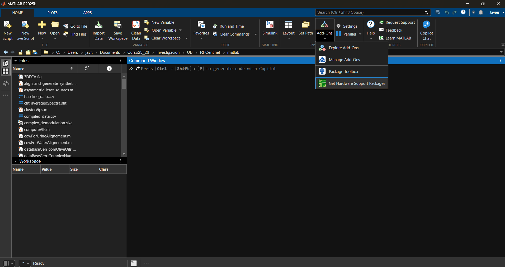
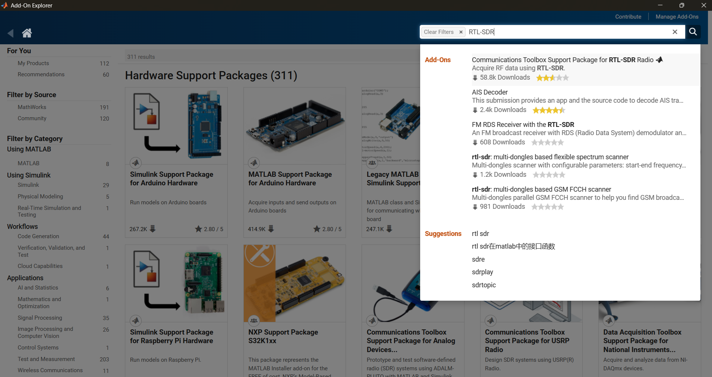

# 📡 Installation Guide: RTL-SDR Hardware Support Package in MATLAB (Windows 10+)

This guide explains how to install and configure de suport package for the RTL-SDR hardware in MATLAB, step by step.

---

## 🧰 Getting Started: Checklist

Before starting anything, be sure you have:

- ✅ an RTL-SDR: in our case the nooelec NESDR Mini 2+
- ✅ a computer running unde Windows 10 or higher
- ✅ a Mathworks account 
- ✅ MATLAB R2021b or higher (this guide has been developed with MATLAB R2023a)
- ✅ Mathworks DSP System Toolbox
- ✅ Mathworks Communication System Toolbox
- ✅ Mathworks Signal Processing Toolbox  
- ✅ Internet access  
- ✅ Admin rights for installing software in Windows

---
All the information presented here is extracted from the following installation instructions:

http://www.mathworks.com/help/supportpkg/rtlsdrradio/ug/support-package-hardware-setup.html

--

## ⬇️ Step 1: Open MATLAb and go to “Add-Ons”

1. Open MATLAB.  
2. In toolbar (up right), click in **Add-Ons**.  
3. Select **Get Hardware Support Packages**.



---

## 📦 Step 2: Search and install RTL-SDR Package

1. In the emerging window, in the searching tool (up-right box) write down **"RTL-SDR"**.  
2. Selecciona **Communication Toolbox Support Package for RTL-SDR Radio**.  
3. Click **Install** in the following Window.



---

## 💾 Step 3: Configuring the hardware

1. Accept the Mathworks Auxiliary Software Licencse Agreement.
2. After installation the software will get you
---

## 🧪 Paso 3: Verificar la instalación

En la ventana de **Command Window** de MATLAB, ejecuta:

```matlab
sdrinfo
